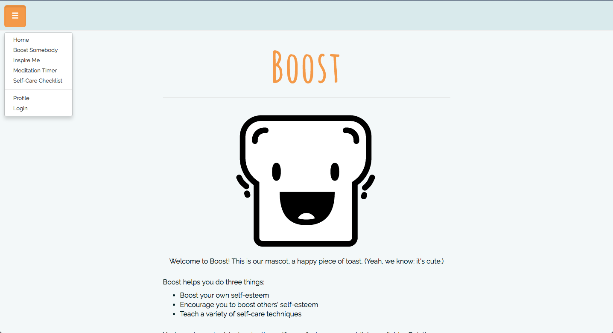

# Boost
A Capstone project, in which I design an app that's a social network where people can act as therapists for strangers with similar problems. Here's how it works: strangers can submit their problems anonymously (called asks). Other users can then offer boosts (similar to Facebook likes) or feedback on how they conquered similar problems in their own lives. This app also includes a meditation timer, a random inspirational quotes generator, and a self-care checklist.

